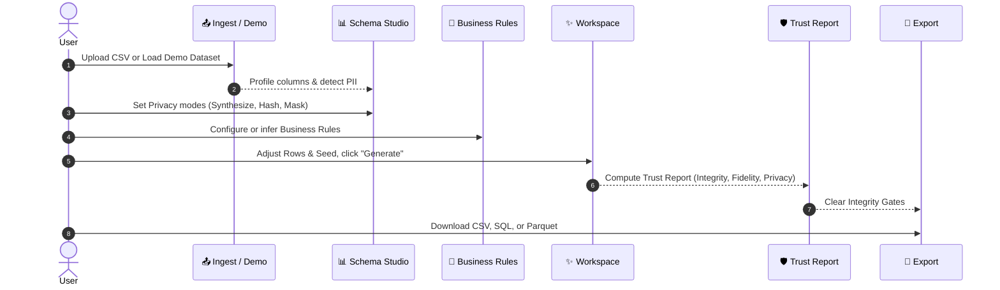

# User Guide: DataSeed Synthetic Data Platform

Welcome to **DataSeed**, an enterprise-grade synthetic data generation, privacy compliance, and validation platform. DataSeed creates byte-reproducible, privacy-safe, high-fidelity synthetic datasets that preserve complex relational structures, foreign key integrity, and business logic constraints.

---

## Table of Contents
1. [Getting Started & Quick Start](#1-getting-started--quick-start)
2. [Navigating the Application (The Dock)](#2-navigating-the-application-the-dock)
3. [Core Feature Walkthrough](#3-core-feature-walkthrough)
   - [Projects Screen](#1-projects-screen)
   - [New Project / Ingest Screen](#2-new-project--ingest-screen)
   - [Schema Studio](#3-schema-studio)
   - [Relationships (ER Diagram)](#4-relationships-er-diagram)
   - [Business Rules](#5-business-rules)
   - [Workspace (Data Generator)](#6-workspace-data-generator)
   - [Trust Report](#7-trust-report)
   - [Financial Documents Generator](#8-financial-documents-generator)
   - [Export Screen](#9-export-screen)
   - [Settings](#10-settings)
4. [Step-by-Step Workflow: From CSV to Verified Export](#4-step-by-step-workflow-from-csv-to-verified-export)
5. [Privacy & Security Best Practices](#5-privacy--security-best-practices)

---

## 1. Getting Started & Quick Start

### Running the Application
1. **Start Backend Engine**:
   ```bash
   python -m uvicorn api.main:app --reload --port 8000
   ```
2. **Start Frontend UI**:
   ```bash
   cd frontend
   npm run dev
   ```
3. Open your browser and navigate to `http://localhost:5173` (or `http://localhost:8000` for production builds).

---

## 2. Navigating the Application (The Dock)

The application uses an interactive **Bottom Dock** for smooth navigation across screens:

| Icon | Screen Name | Keyboard Shortcut / Function |
| :---: | :--- | :--- |
| 📁 | **Projects** | View existing datasets and quality scores |
| 📤 | **New project** | Upload CSV files or load demo data |
| 📊 | **Schema** | Inspect columns, data types, and privacy settings |
| 🔀 | **Relationships** | Interactive React Flow ER Diagram |
| 📜 | **Business rules** | Domain logic constraints & validation rules |
| ✨ | **Workspace** | Live preview and background synthetic data generator |
| 🛡️ | **Trust report** | Quality validation (Fidelity, Utility, Privacy, Integrity) |
| 📄 | **Documents** | Render synthetic Invoices & Bank Statements |
| 💾 | **Export** | Download datasets as CSV, SQL, JSON, Parquet, or Excel |
| ⚙️ | **Settings** | Configuration defaults and AI layer status |

---

## 3. Core Feature Walkthrough

### 1. Projects Screen
- **Overview**: Shows all datasets currently managed by the platform.
- **Metrics at a Glance**: Each project card displays 4 quality scores:
  - **Integrity**: Foreign key and reconciliation accuracy.
  - **Fidelity**: Closeness to source distributions.
  - **Utility**: Machine learning train-on-synthetic test-on-real score.
  - **Privacy**: Record uniqueness and collision avoidance.
- **Search & Filter**: Search projects by name in real time.

---

### 2. New Project / Ingest Screen
- **Upload Custom Data**: Drag and drop single or multi-table CSV files.
- **One-Click Demo Project**: Click **Load Demo Dataset** to load the 5-table *Northwind Retail* benchmark dataset (`customers`, `orders`, `order_items`, `tags`, `customer_tags`).

---

### 3. Schema Studio
- **Table Selector**: Switch between tables in your schema using the left sidebar.
- **Column Properties**:
  - **Semantic Types**: Auto-classified types (e.g. `person_name`, `email`, `phone`, `date`, `currency`).
  - **PII Detection**: Flags columns containing `Direct` or `Quasi` PII.
  - **Privacy Modes**: Configure handling per column:
    - `synthesize`: Generate brand-new realistic values from statistical distributions.
    - `hash`: Convert to one-way fingerprints (preserves joins while redacting content).
    - `mask`: Partially mask string contents while keeping structure.
    - `noise`: Inject calibrated numeric noise.
    - `passthrough`: Keep values as-is.
- **Computed / Derived Fields**: Inspect post-generation fields derived from child tables (e.g. `order_total = SUM(item_price * quantity)`).

---

### 4. Relationships (ER Diagram)
- **Interactive Visual Canvas**: Powered by `@xyflow/react`. Pan, zoom, and drag table cards.
- **Cardinality Badges**: Inspect relationship cardinality (`1:1`, `1:N`, `N:N`).
- **Parent/Child Distribution**: Click an edge or table to inspect the real distribution of children per parent (e.g., number of items per order).
- **Infer Relationships**: Click **Infer relationships** to have the system discover hidden foreign keys using value overlap heuristics or AI models.

---

### 5. Business Rules
- **Domain Constraints**: Define rules that pure statistical models cannot capture (e.g., `orders.total >= 0`, `shipped_date >= order_date`).
- **Rule Types**: Range, Comparison, Enum restriction, Not-Null, Computed fields, Conditional logic, Unique constraints.
- **Automatic Repair**: During generation, rows violating rules are automatically repaired via clamping or resampling.

---

### 6. Workspace (Data Generator)
- **Generation Parameters**:
  - **Rows**: Set total synthetic rows to generate (e.g., 10,000 rows).
  - **Seed**: The random seed number. **Same seed always produces byte-identical results**.
  - **Null Rate & Outlier Rate Sliders**: Fine-tune quality parameters.
- **Live Preview Table**: View 40 sampled rows immediately before executing a full run.
- **Generate Button**: Launches a background job with real-time phase progress metering.

---

### 7. Trust Report
- **Validation Overview**: Calculates 4 comprehensive metrics:
  - **Integrity Score (100/100)**: Verifies 0 orphan foreign keys and 0 subtotal mismatches.
  - **Fidelity Score**: Measures distribution overlap between real and synthetic columns.
  - **Downstream Utility (TSTR)**: Trains ML models on synthetic data and tests them on real holdout data.
  - **Privacy & DCR**: Verifies 0 exact row matches with real data and calculates Distance to Closest Record.
- **Integrity Gates**: Green banner signifies all quality checks passed; red banner blocks export until issues are addressed.

---

### 8. Financial Documents Generator
- **Synthesize Real-World Documents**:
  - **Invoices**: EU, UK, US, or India (GST 18%) invoice templates with line items.
  - **Bank Statements**: Account statements with running balances and ledger integrity.
- **Subtotal & Balance Guarantee**: Document math reconciles arithmetically.
- **ZIP Download**: Download ready-to-use synthetic document packages.

---

### 9. Export Screen
- **Multiple Formats**:
  - **CSV**: Zipped CSV files with `schema.json` and `trust_report.json`.
  - **SQL**: Transactional PostgreSQL dump with `CREATE TABLE`, foreign key constraints, and `INSERT` statements.
  - **JSON**: Combined JSON payload.
  - **Parquet & Excel**: Columnar files or multi-sheet workbooks.
- **Gated Protection**: Export is disabled if integrity checks fail, protecting downstream systems from invalid data.

---

### 10. Settings
- Manage global defaults (default row count, default seed).
- Inspect AI Layer status (`Live` via Mistral/Anthropic API or `Heuristics`).

---

## 4. Step-by-Step Workflow: From CSV to Verified Export



---

## 5. Privacy & Security Best Practices

1. **Deterministic Seeds for Testing**: Use consistent seed numbers (e.g. `42`) when running automated regression tests.
2. **Direct PII Synthesis**: Always set direct PII columns (`name`, `email`, `phone`, `address`) to `synthesize` mode so real values are never resampled.
3. **Collision Enforcement**: DataSeed enforces exact match collision rejection by default. Source records are kept only as one-way fingerprints.
